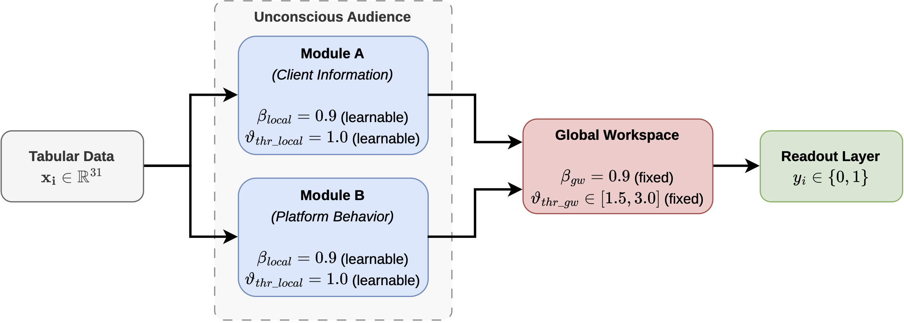

# SpikingGW: Targeting the Consciousness of Spiking Networks with Global Workspace

Source code of the paper entitled "SpikingGW: Targeting the Consciousness of Spiking Networks with Global Workspace" accepted at "CIARP 2026", the 29th Iberoamerican Congress on Pattern Recognition.



## Paper Abstract

Spiking neural networks (SNNs) offer energy efficiency and biological plausibility due to their sparse and event-driven nature. However, they regularly struggle on highly imbalanced pattern recognition tasks. Drawing inspiration from cognitive neuroscience, we introduce SpikingGW, a model architecture that combines SNNs with the global workspace theory (GWT), which is applicable to both convolutional and feed-forward models. In GWT, incoming information is processed unconsciously by specialized modules, and only highly salient stimuli trigger an ignition signal that broadcasts to a global workspace. To validate our approach, we apply SpikingGW to a real-world use case of financial fraud detection, which contains two distinct categories of data necessary for the specialization of the sub-networks. The architecture separates the original feature space into specialized local modules that simulate unconscious processes, whose outputs are aggregated into the global workspace via a thresholded attention bottleneck. Constrained to maximize the true positive rate while maintaining a false positive rate below 5%, SpikingGW models surpass standard convolutional and feed-forward SNNs. Our experiments mainly focus on their learning configurations, temporal window sizes, and attention bottleneck, revealing key insights into their impact on classification performance for both models on highly imbalanced pattern recognition tasks.

## Installation

To install the required packages, run the following command:
```sh
pip install -r requirements.txt
```
Download the six Variant of the Bank Account Fraud (BAF) Dataset and extract the parquet files to the data folder.

## Dataset

The Bank Account Fraud (BAF) dataset is a synthetic dataset based on real-world data that simulates bank account opening applications. The dataset contains 6 parquet files, each representing a different variant of the dataset (Base, Variant I, Variant II, Variant III, Variant IV, and Variant V). It contains 30 features and a binary target variable indicating whether the application is fraudulent or not.

## Repository Structure

The repository is structured as follows:

- `data`: Contains the Bank Account Fraud dataset.
- `images`: Contains the images used in this README file.
- `results`: Contains the results of the experiments.
- `src`: Contains the source code of the project.


## Bibtex

To cite this work, use the following bibtex entry:
```bibtex
TBD
```
## Issues

This code is imported and adapted from the original research repository. Consequently, the code may contain bugs or issues. If you encounter any issues while running the code, please open an issue in the repository.
